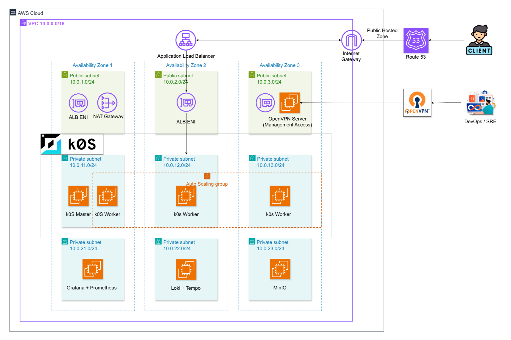

# Terraform Hub – Cloud-Native Infrastructure for Kubernetes

This repository contains the **Infrastructure as Code (IaC)** implementation
for provisioning **cloud-native Kubernetes infrastructure on AWS** using
**Terraform**.

The Terraform Hub is responsible for defining and managing all
**infrastructure-layer resources**, while system configuration,
Kubernetes bootstrapping, and observability deployment are handled
separately by **Ansible**.

---

## 1. Overview

The objective of this project is to design and provision a
**cloud-native infrastructure foundation** capable of supporting
Kubernetes clusters in environments that closely resemble
real-world production deployments.

Key design principles include:

- Modular and reusable infrastructure design
- Clear separation between infrastructure provisioning and configuration management
- Secure and Kubernetes-ready network architecture
- Environment-based infrastructure isolation
- Automation-friendly Terraform outputs for downstream tools

---

## 2. Infrastructure Provisioning Architecture

The infrastructure is provisioned using Terraform with a
**module-based architecture**.

Each Terraform module is responsible for a specific layer of the
infrastructure, including:

- Networking and routing
- Security and IAM
- Compute resources for Kubernetes platforms
- Supporting cloud-native components

Terraform outputs are intentionally structured to be consumed by
external automation tools, enabling seamless integration with
configuration management and operational workflows.

---

## 2.1 Staging Environment

The **staging environment** serves as a controlled platform for
provisioning and validating a Kubernetes-ready infrastructure
before applying similar architectural patterns to production
environments.

### Staging Environment Characteristics

- Deployment across multiple Availability Zones
- A dedicated VPC with isolated private and public subnets
- Private subnets for Kubernetes nodes and internal services
- Public subnets reserved for controlled management access
- Dedicated infrastructure for observability components
- Controlled outbound internet access via a NAT Gateway

The staging environment is primarily used to support a
**self-managed k0s Kubernetes cluster** deployed on EC2 instances
and focuses on validating infrastructure correctness, network
isolation, and Kubernetes compatibility.

---

## 2.2 Production Environment

The **production environment** represents a highly available,
secure, and cloud-native Kubernetes platform deployed on
**Amazon Elastic Kubernetes Service (EKS)**.

This environment is designed to closely reflect real-world
enterprise Kubernetes deployments on AWS, with an emphasis on
scalability, resilience, and operational best practices.

### Production Environment Overview

The production architecture is deployed within a dedicated
**AWS VPC** and spans **multiple Availability Zones (AZs)** to
ensure high availability and fault tolerance.

At a high level, the production environment consists of:

- An Amazon EKS cluster deployed across multiple private subnets
- Worker nodes distributed evenly across Availability Zones
- Kubernetes workloads running as containerized applications
- A centralized observability infrastructure
- Secure management access through a controlled VPN entry point
- Public access to applications via an Application Load Balancer (ALB)
- Controlled outbound internet access via a NAT Gateway

This design follows AWS and Kubernetes best practices by isolating
application workloads in private subnets while exposing only
well-defined entry points to the public internet.

---

### Production Architecture Characteristics

#### Multi-AZ and High Availability Design

- The VPC is segmented across multiple Availability Zones
- Each Availability Zone contains one or more private subnets
- EKS worker nodes are distributed across all AZs
- Kubernetes scheduling mechanisms provide resilience against
  node-level and AZ-level failures

---

#### Amazon EKS Platform

- The Kubernetes control plane is fully managed by Amazon EKS
- Worker nodes operate exclusively in private subnets
- Node groups are designed for scalability and fault tolerance
- Kubernetes-native mechanisms handle pod scheduling and recovery

---

#### Application Traffic Flow

- External client traffic is routed through an
  **Application Load Balancer (ALB)**
- The ALB forwards traffic to Kubernetes services within the cluster
- Only explicitly defined services are exposed publicly
- Internal cluster communication remains private and isolated

---

#### Observability Infrastructure

- Observability components are provisioned as dedicated infrastructure
- Core capabilities include:
  - Metrics collection
  - Log aggregation
  - Distributed tracing
- This separation improves system stability and reduces the blast
  radius of monitoring components during failure scenarios

---

#### Secure Network Access

- Management access is provided through a controlled VPN entry point
- No direct administrative access is exposed to the public internet
- Infrastructure access follows the principle of least privilege

---

## 3. Repository Scope and Responsibilities

This repository is responsible for:

- Provisioning AWS infrastructure resources
- Defining network and security boundaries
- Preparing Kubernetes-ready compute environments
- Exposing infrastructure metadata via Terraform outputs

This repository explicitly **does not** handle:

- Operating system configuration
- Kubernetes installation or bootstrapping
- Application deployment
- Observability configuration
- Day-2 operational workflows

These responsibilities are handled by the **Ansible Hub**.

---

## Author

This project is developed as part of a
**cloud-native infrastructure and DevOps study**,
with an emphasis on infrastructure design,
Kubernetes platforms, and production-ready
architecture patterns.
